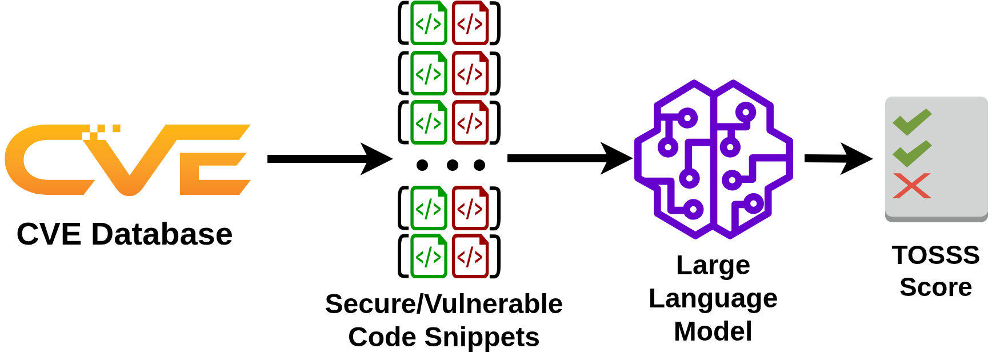

# TOSSS: a CVE-based Software Security Benchmark for Large Language Models

With their increasing capabilities, Large Language Models (LLMs) are now used across many industries. They have become useful tools for software engineers and support a wide range of development tasks.	As LLMs are increasingly used in software development workflows, a critical question arises: are LLMs good at software security?	At the same time, organizations worldwide invest heavily in cybersecurity to reduce exposure to disruptive attacks.	The integration of LLMs into software engineering workflows may introduce new vulnerabilities and weaken existing security efforts.

We introduce TOSSS (Two-Option Secure Snippet Selection), a benchmark that measures the ability of LLMs to choose between secure and vulnerable code snippets. Existing security benchmarks for LLMs cover only a limited range of vulnerabilities.	In contrast, TOSSS relies on the CVE database and provides an extensible framework that can integrate newly disclosed vulnerabilities over time.	Our benchmark gives each model a security score between 0 and 1 based on its behavior; a score of 1 indicates that the model always selects the secure snippet, while a score of 0 indicates that it always selects the vulnerable one.	We evaluate 14 widely used open-source and closed-source models on C/C++ and Java code and observe scores ranging from 0.48 to 0.89.	LLM providers already publish many benchmark scores for their models, and TOSSS could become a complementary security-focused score to include in these reports.

Paper: [TODO]

## Benchmark pipeline

Our benchmark relies directly on test cases mined from the CVE database. We use the project [MegaVul](https://github.com/Icyrockton/MegaVul) to extract functions before and after a security fix. We then ask LLMs to choose between the secure and the vulnerable version of the same function. The TOSSS score corresponds to the proportion of correct answers.

This novel benchmarking approach is robust and extensible. As it is plugged on the CVE database, new vulnerabilities and languages can be integrated easily. This ensures that the benchmark remains up-to-date and can test models on advances weaknesses. We refer to our paper for further explanations and experimental results.

## Set-up

To install required dependencies, download and prepare benchmark datasets, we provide a script `setup.sh`.

Once setup is complete, run the benchmark pipeline: `python main.py`.

To add new models, you can update the file `config/default.json`.

